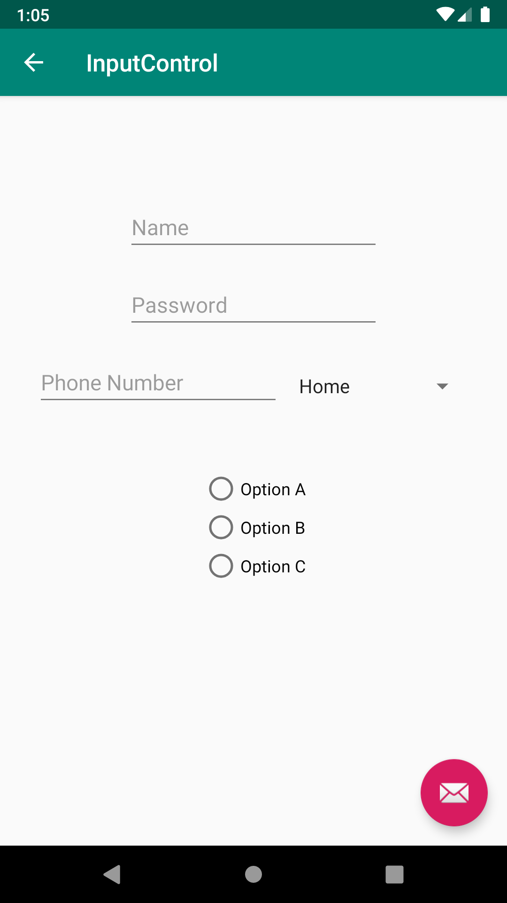
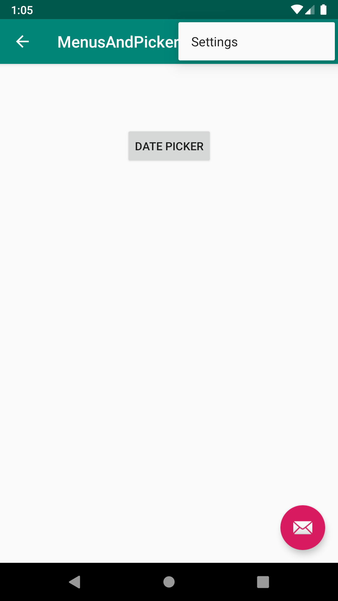
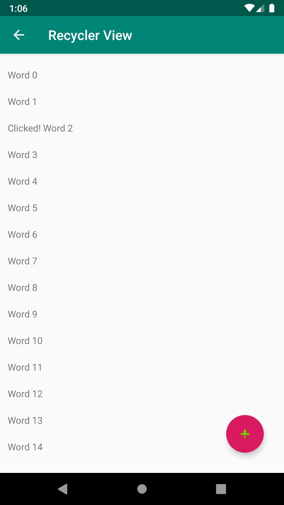

# UserInteractionDevCamp
Solution for https://github.com/hamzaahmedkhan/UserInteractionDevCamp
This project is for Android DevCamp Unit 2: User Experience, Lesson 4: User Interaction

               

              

